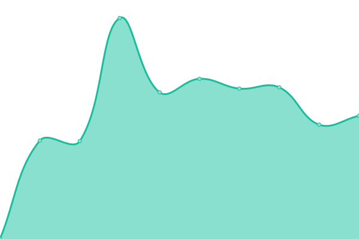
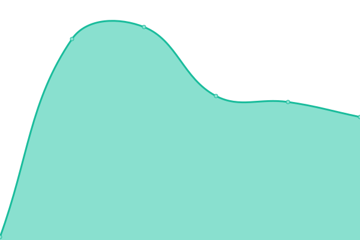
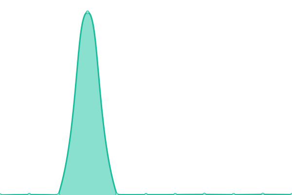

# [📈 Live Status](https://ahmetcimen.github.io/CRAPI_Upptime): <!--live status--> **🟥 Complete outage**

This repository contains the open-source uptime monitor and status page for [Ahmet Çimen](https://ahmetcimen.github.io/CRAPI_Upptime), powered by [Upptime](https://github.com/upptime/upptime).

With [Upptime](https://upptime.js.org), you can get your own unlimited and free uptime monitor and status page, powered entirely by a GitHub repository. We use [Issues](https://github.com/ahmetcimen/CRAPI_Upptime/issues) as incident reports, [Actions](https://github.com/ahmetcimen/CRAPI_Upptime/actions) as uptime monitors, and [Pages](https://ahmetcimen.github.io/CRAPI_Upptime) for the status page.

<!--start: status pages-->
<!-- This summary is generated by Upptime (https://github.com/upptime/upptime) -->
<!-- Do not edit this manually, your changes will be overwritten -->
<!-- prettier-ignore -->
| URL | Status | History | Response Time | Uptime |
| --- | ------ | ------- | ------------- | ------ |
|  [CR Metric Info](34.125.236.8:3000/api/metricInfo) | 🟥 Down | [cr-metric-info.yml](https://github.com/ahmetcimen/CRAPI_Upptime/commits/HEAD/history/cr-metric-info.yml) | 

 0ms
     
 | 

<a href="https://ahmetcimen.github.io/CRAPI_Upptime/history/cr-metric-info">0.00%</a>
    

|  [CR Contracts](34.125.236.8:3000/api/contracts) | 🟥 Down | [cr-contracts.yml](https://github.com/ahmetcimen/CRAPI_Upptime/commits/HEAD/history/cr-contracts.yml) | 

 0ms
     
 | 

<a href="https://ahmetcimen.github.io/CRAPI_Upptime/history/cr-contracts">0.00%</a>
    

|  [CR Metrics](34.125.236.8:3000/api/metrics) | 🟥 Down | [cr-metrics.yml](https://github.com/ahmetcimen/CRAPI_Upptime/commits/HEAD/history/cr-metrics.yml) | 

 0ms
     
 | 

<a href="https://ahmetcimen.github.io/CRAPI_Upptime/history/cr-metrics">0.00%</a>
    

<!--end: status pages-->

[**Visit our status website →**](https://ahmetcimen.github.io/CRAPI_Upptime)

## 📄 License

- Powered by: [Upptime](https://github.com/upptime/upptime)
- Code: [MIT](./LICENSE) © [Ahmet Çimen](https://ahmetcimen.github.io/CRAPI_Upptime)
- Data in the `./history` directory: [Open Database License](https://opendatacommons.org/licenses/odbl/1-0/)
